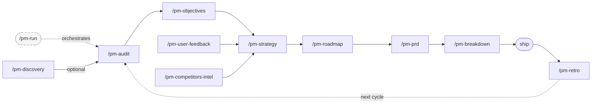

# nanopm

**Autonomous product management for Claude Code.**

Built for solo founders and small teams who need to make sharp product decisions
without a dedicated PM. You answer questions. nanopm does the thinking.

---

## Install

```bash
curl -fsSL https://raw.githubusercontent.com/nmrtn/nanopm/main/setup | bash
```

Installs to `~/.claude/skills/nanopm/`. Skills appear as `/pm-*` commands in Claude Code.

**Requirements:** Claude Code. `python3` (standard on macOS/Linux).

---

## Quick start

**Not sure what to build?**
```
/pm-discovery
```
Maps the opportunity space, surfaces your riskiest assumptions, designs the cheapest tests.
Run this before building anything.

**Know what you're building?**
```
/pm-audit
```
Answer 11 questions about your product. Get a brutally honest assessment:
what you're actually building, who you're actually building it for,
the biggest gap, and the question you're avoiding.

**Want the full pipeline in one command?**
```
/pm-run
```

---

## What you get

### From `/pm-audit`

```markdown
## What You're Actually Building

A project management tool for solo founders. The core loop is a kanban board
with AI summaries of weekly progress. Despite being marketed as a team tool,
90% of active users are solo operators.

## The Biggest Strategic Gap Right Now

You're optimizing for a customer you don't have yet. Pricing, onboarding, and
messaging all assume team collaboration — but your actual users are alone.
This mismatch is causing confusion in onboarding and churn after trial.

## The Question You're Avoiding

Are solo founders willing to pay for productivity tooling, or do they just use
whatever is free and good enough?
```

### From `/pm-strategy` (adversarial challenge)

```markdown
## Challenged by adversarial review

**Core assumption:** Solo founders will pay $20/month for a focused kanban tool
when Notion is free and "good enough."

**What would falsify it:** Fewer than 15% of trial users enter payment details
within 14 days, despite active usage.

**Cheapest test:** DM 10 active free users this week. Ask what they'd cut before
paying for this. You'll know in 48 hours.
```

### From `/pm-discovery`

```markdown
## Tests to Run

### Test 1 — Core assumption (risk score: 16/25)
Assumption: Users find their current workaround painful enough to change behavior.
What: Watch 3 users do their weekly planning using their current setup.
Look for the moment of friction. Don't demo anything.
Time/cost: 2 hours, this week.
Signal: User expresses frustration unprompted, or asks "does your tool do X?"
```

---

## All skills

```
/pm-run              → full pipeline in one command
/pm-discovery        → figure out WHAT to build before planning HOW
/pm-audit            → brutal honest assessment of product, user, and biggest gap
/pm-objectives       → OKRs with anti-goals and measurable key results
/pm-user-feedback    → aggregate feedback from Dovetail, Productboard, etc; cluster themes, surface top signal
/pm-competitors-intel → monitor competitor pages, diff snapshots, surface strategic implications
/pm-strategy         → strategy + mandatory adversarial challenge (assumption, test, cost)
/pm-roadmap          → outcome-driven roadmap (Shape Up / Scrum / NOW-NEXT-LATER)
/pm-prd              → full PRD or Shape Up pitch, adapts to your methodology
/pm-breakdown        → break PRD into tasks, create tickets in Linear / GitHub Issues
/pm-retro            → compare roadmap vs commits, surface what drifted
```

The pipeline compounds. The audit informs objectives. The strategy shapes the roadmap.
The PRD feeds the tickets. Every skill also works standalone.

---

## Pipeline



---

## How it gets data

nanopm tries each tier in order, uses the highest available:

| Tier | How | Setup |
|------|-----|-------|
| 1 — MCP | Direct tool calls | Add `mcp__linear__*` etc. to your Claude config |
| 2 — API | REST/GraphQL | Set `LINEAR_API_KEY`, `NOTION_API_KEY`, `GITHUB_TOKEN`, etc. |
| 3 — Browser | Headless scrape | Install browse binary, sign in once in your browser |
| 4 — Manual | You fill it in | Always works, zero setup |

No integrations required. Tier 4 always works.

Connectors: Linear, GitHub Issues, Notion, Dovetail.

---

## Memory

nanopm builds a persistent model of your product in `~/.nanopm/memory/{project}.jsonl`.
Every skill run appends to it. Every new skill knows what was tried before.
Re-run `/pm-audit` six months later — it knows the history.

---

## Methodology support

nanopm detects your methodology at audit time and adapts its artifacts:

- **Shape Up** → roadmap uses bets + appetite + cool-down; PRDs become pitches
- **Scrum/Agile** → roadmap uses sprint framing, epics, story points
- **Kanban / hybrid / none** → NOW/NEXT/LATER roadmap, standard PRDs

The audit, objectives, and strategy are methodology-agnostic.

---

## Staleness detection

Every skill run warns if your AUDIT.md or STRATEGY.md is more than 20 commits old:

```
⚠  nanopm: AUDIT.md is 34 commits old — consider re-running /pm-audit
```

---

## Uninstall

```bash
bash uninstall          # removes skills, keeps ~/.nanopm/ memory
bash uninstall --purge  # removes everything including memory and config
```

---

## Contributing

Add a connector: one markdown file in `connectors/`. See `connectors/README.md`.
Add a skill: copy any `pm-*/SKILL.md`, follow the preamble pattern in `lib/nanopm.sh`.

## Tests

```bash
bash test/skill-syntax.sh          # static checks (no LLM needed)
bash test/context-threading.e2e.sh # context plumbing E2E
bash test/website-bootstrap.e2e.sh # browser tier scenarios
bash test/adversarial.e2e.sh       # adversarial subagent gate (needs claude CLI)
```

---

*Inspired by [gstack](https://github.com/garrytan/gstack) — thank you Garry for the skill
architecture pattern and for proving that AI can own an entire engineering function end-to-end.*

MIT license.
