# nanopm

[](https://opensource.org/licenses/MIT)
[](CHANGELOG.md)

A PM skill pack for AI coding agents. Runs the planning cycle (audit, strategy, roadmap, PRD) inside the agent you already use. Keeps typed state across sessions. Won't write a PRD until you name what would prove your bet wrong.

Works with Claude Code, Mistral Vibe, and OpenAI Codex. One install command picks up whichever you have.

Built on the SKILL.md standard from [gstack](https://github.com/garrytan/gstack). nanopm is the PM layer.

---

## Why this exists

Building the wrong thing fast is the failure mode AI coding agents make easy. They'll ship whatever you describe — they don't ask if it's the right thing.

The PM work that catches that (audit, strategy, falsification, roadmap, retro) usually lives in tools that don't know your code, lose context between sessions, and don't talk to each other. ChatGPT for the strategy. Notion for the PRD. Linear for the tickets. Nothing compounds.

nanopm runs the whole cycle where you already work, with two structural properties:

1. **Every artifact lands in typed, schema-validated state.** Each skill writes to `~/.nanopm/projects/{slug}/{type}.jsonl`. The next skill reads from there. No grep on markdown, no silent corruption, no `tail -1 | cut -d'|'` parsing.
2. **Adversarial gates on the claims that matter.** Every strategy needs a falsifiable bet. Every NOW roadmap item needs a measurable outcome with a timeframe. Every PRD needs a paragraph stating what would prove it wrong. Each gate is a subagent against a rubric plus a state validator. A skill cannot complete unless a well-formed record actually lands.

One command runs the full pipeline: `/pm-run`. Or invoke any skill standalone.

---

## Example

```
You:     /pm-audit

nanopm:  Q1: What are you building? (one sentence)
You:     An AI agent harness for financial advisors — automates
         client reporting, portfolio commentary, and compliance checks.

nanopm:  Q2: Who is it actually for?
You:     Independent RIAs managing $50M–$500M books, no ops team.

...11 questions later...

nanopm:  AUDIT.md written.

         Biggest gap: you're solving the reporting problem, but the
         job your users are actually hired to do is winning and
         keeping clients. Faster reports don't help if advisors
         can't explain the AI's output to a nervous client.
         Question you're avoiding: would a compliance officer
         sign off on AI-generated commentary going out unsupervised?

         Recommended next: /pm-discovery
```

---

## Who it's for

- **Solo founder running PM yourself.** Audit your own product before you keep building.
- **Engineer without a PM partner.** Strategy, roadmap and PRDs in your editor, not in a separate tab.
- **Small team without a dedicated PM seat.** A repeatable cycle that doesn't depend on a hire.

If you already have a polished product process and a PM you trust, you don't need this.

---

## Install

```bash
# Auto-detect installed agents (Claude Code, Mistral Vibe, OpenAI Codex)
curl -fsSL https://raw.githubusercontent.com/nmrtn/nanopm/main/setup | bash

# Target a specific host
curl -fsSL https://raw.githubusercontent.com/nmrtn/nanopm/main/setup | bash -s -- --host=claude
curl -fsSL https://raw.githubusercontent.com/nmrtn/nanopm/main/setup | bash -s -- --host=vibe
curl -fsSL https://raw.githubusercontent.com/nmrtn/nanopm/main/setup | bash -s -- --host=codex

# Install to all hosts at once
curl -fsSL https://raw.githubusercontent.com/nmrtn/nanopm/main/setup | bash -s -- --host=all
```

| Host | Skills install to | Invocation |
|------|-------------------|------------|
| Claude Code | `~/.claude/skills/` | `/pm-*` commands |
| Mistral Vibe | `~/.vibe/skills/` | `/pm-*` commands |
| OpenAI Codex | `~/.codex/skills/` | `/pm-*` commands |

**Requirements:** One of: Claude Code, Mistral Vibe, or OpenAI Codex. `python3` (standard on macOS/Linux).

---

## All skills

**Planning pipeline:**
```
/pm-run              → full pipeline in one command
/pm-scan             → read an existing codebase to understand what it actually does before planning
/pm-discovery        → figure out WHAT to build before planning HOW (pre-product / greenfield)
/pm-audit            → brutal honest assessment of product, user, and biggest gap
/pm-objectives       → OKRs with anti-goals and measurable key results
/pm-user-feedback    → aggregate feedback from Dovetail, Productboard, etc; cluster themes, surface top signal
/pm-competitors-intel → monitor competitor pages, diff snapshots, surface strategic implications
/pm-strategy         → strategy + mandatory adversarial challenge (assumption, test, cost)
/pm-roadmap          → outcome-driven roadmap (Shape Up / Scrum / NOW-NEXT-LATER)
/pm-prd              → full PRD or Shape Up pitch, adapts to your methodology
/pm-breakdown        → break PRD into tasks, hand off to Linear / GitHub / OpenSpec / gstack / Human
/pm-retro            → compare roadmap vs commits, surface what drifted
```

**Daily ops:**
```
/pm-standup          → morning briefing — what shipped, today's meetings, top 1-3 priorities
/pm-interview        → prepare a user interview guide, or debrief a transcript from Granola
/pm-weekly-update    → draft stakeholder update email (CEO, investor, or team), adapted to audience
/pm-data             → answer a product question using PostHog or Amplitude — trends, funnels, retention
```

The pipeline compounds. Every skill also works standalone.

---

## Pipeline

Three zones: signal in, nanopm cycle, delivery out.

```mermaid
graph LR
    subgraph IN["INPUTS — signal"]
      direction TB
      SCAN["/pm-scan<br/><i>codebase</i>"]
      DISC["/pm-discovery<br/><i>greenfield</i>"]
      UF["/pm-user-feedback"]
      INT["/pm-interview"]
      DATA["/pm-data"]
      CI["/pm-competitors-intel"]
    end

    subgraph PIPE["PIPELINE — nanopm"]
      direction LR
      AUD[audit] --> OBJ[objectives] --> STR[strategy] --> RM[roadmap] --> PRD[PRD] --> BD[breakdown]
    end

    subgraph OUT["HANDOFFS — delivery"]
      direction TB
      LIN[Linear]
      GH[GitHub]
      OS[OpenSpec]
      GS[gstack]
      HU[Human markdown]
    end

    IN --> PIPE
    PIPE --> OUT

    classDef zone fill:#fafafa,stroke:#ccc
    class IN,PIPE,OUT zone
```



Every committed roadmap item, every PRD bet, and every strategic question lands as a typed record in `~/.nanopm/projects/{slug}/decision.jsonl`. The next skill reads from there.

---

## Memory

State lives in `~/.nanopm/projects/{slug}/` as append-only, schema-validated JSONL — one file per record type:

| File | What it holds |
|---|---|
| `decision.jsonl` | Typed PM decisions: `bet`, `antigoal`, `target`, `methodology`, `gap`, `question`, `scope-in`, `scope-out`. Each carries confidence 1–10 and provenance (`observed`, `user-stated`, `inferred`, `derived`, `adversarial`). |
| `prd.jsonl` | Per-feature metadata: status (`draft`, `ready`, `handed-off`, `shipped`, `abandoned`), target, path. |
| `handoff.jsonl` | Which target each PRD went to, when, where. |
| `timeline.jsonl` | Skill run events: started, completed, outcome, duration. |

Every write goes through `bin/nanopm-state-log`, which enforces the schema before append — required fields, enum allowlists, key format, confidence range, length caps. Bad records fail loud with a non-zero exit. There are no silent appends.

Re-run `/pm-audit` six months later and it reads the prior decisions before asking anything new.

---

## How it compares

| | nanopm | DIY prompts in your agent | Notion / Linear | ChatGPT |
|---|---|---|---|---|
| Lives in your editor | ✅ | ✅ | ❌ | ❌ |
| Typed memory across sessions | ✅ schema-validated JSONL | ❌ | ⚠️ manual writes | ❌ |
| Full PM pipeline (audit → PRD) | ✅ | ⚠️ if you reprompt every time | ❌ | ❌ |
| Reads your codebase | ✅ | ✅ | ❌ | ❌ |
| Adversarial gates on bets & outcomes | ✅ subagent + state validator | ❌ | ❌ | ❌ |
| Peer handoff targets | ✅ Linear / GitHub / OpenSpec / gstack / human | ⚠️ ad-hoc | ⚠️ Linear only | ❌ |
| Multi-host (Claude / Vibe / Codex) | ✅ | n/a | n/a | n/a |
| Adapts to Shape Up / Scrum / Kanban | ✅ | ⚠️ if you prompt it | ✅ | ❌ |
| Zero-config — works without integrations | ✅ tier 4 manual | ✅ | ❌ | ✅ |

The point isn't to replace your tracker. The point is to make the decisions *before* the tracker — and make sure those decisions are typed, falsifiable, and still here next session.

---

## How it gets data

nanopm tries each tier in order, uses the highest available:

| Tier | How | Setup |
|------|-----|-------|
| 1 — MCP | Direct tool calls | Add `mcp__linear__*` etc. to your agent's config |
| 2 — API | REST/GraphQL | Set `LINEAR_API_KEY`, `NOTION_API_KEY`, `GITHUB_TOKEN`, etc. |
| 3 — Browser | Headless scrape | Install browse binary, sign in once in your browser |
| 4 — Manual | You fill it in | Always works, zero setup |

No integrations required. Tier 4 always works.

**Connectors:**

| Connector | Primary use | Tier 1 (MCP) | Tier 2 (API key) |
|-----------|------------|-------------|-----------------|
| Linear | Sprint, issues, roadmap | ✅ | `LINEAR_API_KEY` |
| GitHub Issues | PRs, releases, issues | ✅ | `GITHUB_TOKEN` |
| Notion | Pages, databases | ✅ | `NOTION_API_KEY` |
| Dovetail | Insights, themes | — | `DOVETAIL_API_KEY` |
| Productboard | Features, user notes | — | `PRODUCTBOARD_API_KEY` |
| PostHog | Trends, funnels, retention | ✅ | `POSTHOG_API_KEY` |
| Amplitude | Trends, funnels, retention | — | `AMPLITUDE_API_KEY` |
| Mixpanel | Event trends, funnels | — | `MIXPANEL_SERVICE_ACCOUNT` |
| Google Calendar | Today's meetings | ✅ | — |
| Granola | Meeting transcripts | ✅ | — |
| Intercom | Support tickets, themes | — | `INTERCOM_API_TOKEN` |
| HubSpot | Pipeline, ICP signal | — | `HUBSPOT_API_KEY` |
| Jira | Sprint, blockers | (preview) | `JIRA_API_TOKEN` |
| Google Drive | PRDs, research docs | ✅ | — |
| Slack | Channel decisions | ✅ | `SLACK_API_TOKEN` |

See [`connectors/README.md`](connectors/README.md) for full setup details per connector.

---

## Methodology support

nanopm detects your methodology at audit time and adapts its artifacts:

- **Shape Up** → roadmap uses bets + appetite + cool-down; PRDs become pitches
- **Scrum/Agile** → roadmap uses sprint framing, epics, story points
- **Kanban / hybrid / none** → NOW/NEXT/LATER roadmap, standard PRDs

---

## Staleness detection

Every skill run warns if your AUDIT.md or STRATEGY.md is more than 20 commits old:

```
⚠  nanopm: AUDIT.md is 34 commits old — consider re-running /pm-audit
```

---

## Handoffs

nanopm runs the PM half. Delivery lives elsewhere. `/pm-breakdown` writes the breakdown to one of five peer targets — no preferred default, you pick the one that fits how the project actually ships.

**Linear** — issues created in a Linear team via MCP or `LINEAR_API_KEY`. Each ticket carries the acceptance criteria and ties back to the PRD requirement.

**GitHub Issues** — issues in the repo via MCP or `GITHUB_TOKEN`. Body links the PRD and embeds acceptance.

**OpenSpec** — writes `openspec/changes/{feature}/` with `proposal.md`, `design.md`, `tasks.md`, and `specs/{feature}/spec.md` (requirements as SHALL statements). Pick this up with `/opsx:apply` to implement. If your repo already uses OpenSpec, `/pm-scan` will read `openspec/specs/` automatically — specs describe intent more accurately than READMEs.

**gstack** — writes `~/.gstack/projects/{slug}/ceo-plans/{date}-{feature}.md` with a `status: ACTIVE` frontmatter. Pick this up in a [gstack](https://github.com/garrytan/gstack) session with `/plan-ceo-review` or `/autoplan` — the file is read directly from gstack's plan glob.

**Human** — single self-contained markdown at `.nanopm/handoffs/{feature}.md`. PRD body plus copy-paste-ready ticket blocks. Paste into Notion, Jira, a Slack thread, an email, anything. No external system touched.

Every handoff is recorded in `~/.nanopm/projects/{slug}/handoff.jsonl` — typed, schema-validated, queryable later.

---

## Uninstall

```bash
bash uninstall          # removes skills, keeps ~/.nanopm/ memory
bash uninstall --purge  # removes everything including memory and config
```

---

## Contributing

Add a connector: one markdown file in `connectors/`. See `connectors/README.md`.
Add a skill: copy any `pm-*/SKILL.md`, follow the preamble pattern in `lib/nanopm.sh`.

## Tests

```bash
bash test/run-all.sh               # run the full local suite (no LLM, no network)
bash test/run-all.sh --with-llm    # also run the adversarial e2e (needs claude CLI)
```

Individual suites:

```bash
bash test/skill-syntax.sh           # static checks: frontmatter, gates, state binaries, telemetry purge
bash test/state-layer.sh            # nanopm-state-log/read validators (25 checks)
bash test/multi-host.sh             # NANOPM_HOST detection + nanopm_skill_path resolution (14 checks)
bash test/gates.sh                  # ETHOS gates wired in pm-audit / pm-roadmap / pm-prd (29 checks)
bash test/context-threading.e2e.sh  # legacy context append plumbing
bash test/website-bootstrap.e2e.sh  # browse + connector tier detection
bash test/adversarial.e2e.sh        # adversarial subagent gate (needs claude CLI)
```

---

*Built on the SKILL.md standard from [gstack](https://github.com/garrytan/gstack).*
