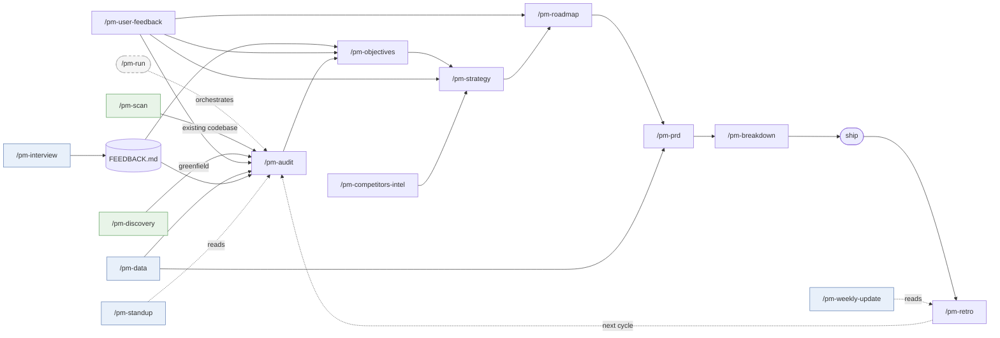

# nanopm

[](https://opensource.org/licenses/MIT)

**You think. nanopm structures it.**

Solo founders and small teams don't have a PM. They have a backlog, some instincts, and a nagging feeling they're building the wrong thing. nanopm is an AI-powered product management skill pack for AI coding agents — it automates the full planning cycle (audit → strategy → roadmap → PRD) directly in your editor and remembers everything across sessions.

Works with Claude Code, Mistral Vibe, and OpenAI Codex. One install command auto-detects which agents you have.

Inspired by [gstack](https://github.com/garrytan/gstack) by Garry Tan (YC CEO), which proved you can give an AI coding agent a full engineering team via the SKILL.md standard. nanopm is the PM layer on top of that idea.

---

## The problem

Product work with AI is fragmented:

- You prompt ChatGPT for a strategy. Context is gone next session.
- You track roadmap in Notion. It doesn't know your codebase.
- You write PRDs in Linear. They don't feed back into your next audit.
- You switch between tools constantly. Nothing compounds.

No existing tool runs the full planning cycle, persists memory, and lives where you code.

---

## What it does

One command runs the full pipeline:

```
/pm-run
```

```
feedback → audit → objectives → strategy → roadmap → PRD → tickets
```

Each skill writes a markdown artifact. The next skill reads it. Context compounds — the strategy knows the audit, the PRD knows the strategy, the tickets know the PRD. Re-run `/pm-audit` six months later and it knows what you tried before.

---

## Example

```
You:     /pm-audit

nanopm:  Q1: What are you building? (one sentence)
You:     An AI agent harness for financial advisors — automates
         client reporting, portfolio commentary, and compliance checks.

nanopm:  Q2: Who is it actually for?
You:     Independent RIAs managing $50M–$500M books, no ops team.

...11 questions later...

nanopm:  AUDIT.md written.

         Biggest gap: you're solving the reporting problem, but the
         job your users are actually hired to do is winning and
         keeping clients. Faster reports don't help if advisors
         can't explain the AI's output to a nervous client.
         Question you're avoiding: would a compliance officer
         sign off on AI-generated commentary going out unsupervised?

         Recommended next: /pm-discovery
```

---

## Who it's for

- **Solo founders acting as their own PM** — structured product thinking without leaving the terminal
- **Engineers doing product work** — go from codebase to roadmap without context-switching
- **Small teams without a dedicated PM** — a repeatable process that compounds over time
- **AI-native builders using Vibe, Codex, or Claude Code** — product planning that lives next to your code, not in a separate tab

---

## Install

```bash
# Auto-detect installed agents (Claude Code, Mistral Vibe, OpenAI Codex)
curl -fsSL https://raw.githubusercontent.com/nmrtn/nanopm/main/setup | bash

# Target a specific host
curl -fsSL https://raw.githubusercontent.com/nmrtn/nanopm/main/setup | bash -s -- --host=claude
curl -fsSL https://raw.githubusercontent.com/nmrtn/nanopm/main/setup | bash -s -- --host=vibe
curl -fsSL https://raw.githubusercontent.com/nmrtn/nanopm/main/setup | bash -s -- --host=codex

# Install to all hosts at once
curl -fsSL https://raw.githubusercontent.com/nmrtn/nanopm/main/setup | bash -s -- --host=all
```

| Host | Skills install to | Invocation |
|------|-------------------|------------|
| Claude Code | `~/.claude/skills/` | `/pm-*` commands |
| Mistral Vibe | `~/.vibe/skills/` | `/pm-*` commands |
| OpenAI Codex | `~/.codex/skills/` | `/pm-*` commands |

**Requirements:** One of: Claude Code, Mistral Vibe, or OpenAI Codex. `python3` (standard on macOS/Linux).

**Note:** During setup, you'll choose a telemetry tier (off/anonymous). See [Analytics & Telemetry](#analytics--telemetry) for details.

---

## All skills

**Planning pipeline:**
```
/pm-run              → full pipeline in one command
/pm-scan             → read an existing codebase to understand what it actually does before planning
/pm-discovery        → figure out WHAT to build before planning HOW (pre-product / greenfield)
/pm-audit            → brutal honest assessment of product, user, and biggest gap
/pm-objectives       → OKRs with anti-goals and measurable key results
/pm-user-feedback    → aggregate feedback from Dovetail, Productboard, etc; cluster themes, surface top signal
/pm-competitors-intel → monitor competitor pages, diff snapshots, surface strategic implications
/pm-strategy         → strategy + mandatory adversarial challenge (assumption, test, cost)
/pm-roadmap          → outcome-driven roadmap (Shape Up / Scrum / NOW-NEXT-LATER)
/pm-prd              → full PRD or Shape Up pitch, adapts to your methodology
/pm-breakdown        → break PRD into tasks, create tickets in Linear / GitHub Issues
/pm-retro            → compare roadmap vs commits, surface what drifted
```

**Daily ops:**
```
/pm-standup          → morning briefing — what shipped, today's meetings, top 1-3 priorities
/pm-interview        → prepare a user interview guide, or debrief a transcript from Granola
/pm-weekly-update    → draft stakeholder update email (CEO, investor, or team), adapted to audience
/pm-data             → answer a product question using PostHog or Amplitude — trends, funnels, retention
```

The pipeline compounds. Every skill also works standalone.

---

## Pipeline



---

## Memory

Every skill run appends to `~/.nanopm/memory/{project}.jsonl`. Every new skill knows what was tried before. Re-run `/pm-audit` six months later — it knows the history. No other PM tool does this because no other PM tool lives inside your coding agent.

---

## How it compares

| | nanopm | AI agent alone | Notion / Linear | ChatGPT |
|---|---|---|---|---|
| Lives in your editor | ✅ | ✅ | ❌ | ❌ |
| Persistent memory across sessions | ✅ | ❌ | ⚠️ manual | ❌ |
| Full pipeline (audit → PRD) | ✅ | ❌ | ❌ | ❌ |
| Reads your codebase | ✅ | ✅ | ❌ | ❌ |
| Zero-config (no integrations required) | ✅ | ✅ | ❌ | ✅ |
| Adapts to Shape Up / Scrum / Kanban | ✅ | ⚠️ if you prompt it | ✅ | ❌ |
| Outputs tickets & engineering specs | ✅ Linear, GitHub, OpenSpec | ⚠️ ad-hoc | ⚠️ Linear only | ❌ |

AI coding agents are powerful but stateless — context resets every session, there's no structured pipeline, and methodology has to be re-explained each time. nanopm is what you add when you want the PM workflow to be repeatable, not improvised.

---

## How it gets data

nanopm tries each tier in order, uses the highest available:

| Tier | How | Setup |
|------|-----|-------|
| 1 — MCP | Direct tool calls | Add `mcp__linear__*` etc. to your agent's config |
| 2 — API | REST/GraphQL | Set `LINEAR_API_KEY`, `NOTION_API_KEY`, `GITHUB_TOKEN`, etc. |
| 3 — Browser | Headless scrape | Install browse binary, sign in once in your browser |
| 4 — Manual | You fill it in | Always works, zero setup |

No integrations required. Tier 4 always works.

**Connectors:**

| Connector | Primary use | Tier 1 (MCP) | Tier 2 (API key) |
|-----------|------------|-------------|-----------------|
| Linear | Sprint, issues, roadmap | ✅ | `LINEAR_API_KEY` |
| GitHub Issues | PRs, releases, issues | ✅ | `GITHUB_TOKEN` |
| Notion | Pages, databases | ✅ | `NOTION_API_KEY` |
| Dovetail | Insights, themes | — | `DOVETAIL_API_KEY` |
| Productboard | Features, user notes | — | `PRODUCTBOARD_API_KEY` |
| PostHog | Trends, funnels, retention | ✅ | `POSTHOG_API_KEY` |
| Amplitude | Trends, funnels, retention | — | `AMPLITUDE_API_KEY` |
| Mixpanel | Event trends, funnels | — | `MIXPANEL_SERVICE_ACCOUNT` |
| Google Calendar | Today's meetings | ✅ | — |
| Granola | Meeting transcripts | ✅ | — |
| Intercom | Support tickets, themes | — | `INTERCOM_API_TOKEN` |
| HubSpot | Pipeline, ICP signal | — | `HUBSPOT_API_KEY` |
| Jira | Sprint, blockers | (preview) | `JIRA_API_TOKEN` |
| Google Drive | PRDs, research docs | ✅ | — |
| Slack | Channel decisions | ✅ | `SLACK_API_TOKEN` |

See [`connectors/README.md`](connectors/README.md) for full setup details per connector.

---

## Methodology support

nanopm detects your methodology at audit time and adapts its artifacts:

- **Shape Up** → roadmap uses bets + appetite + cool-down; PRDs become pitches
- **Scrum/Agile** → roadmap uses sprint framing, epics, story points
- **Kanban / hybrid / none** → NOW/NEXT/LATER roadmap, standard PRDs

---

## Staleness detection

Every skill run warns if your AUDIT.md or STRATEGY.md is more than 20 commits old:

```
⚠  nanopm: AUDIT.md is 34 commits old — consider re-running /pm-audit
```

---

## Analytics & Telemetry

nanopm collects anonymous usage data to understand which skills are most useful.

**What's collected:**
- Skill name (e.g., `pm-audit`, `pm-strategy`)
- Duration in seconds
- Outcome (`success`, `error`, `abort`)
- OS and architecture (e.g., `darwin`, `arm64`)
- nanopm version

### What's NOT collected

- Your code
- Project names
- File paths
- Personal data
- IP addresses (not logged server-side)
- Installation IDs or any tracking identifier

### View your local analytics

```bash
~/.nanopm/bin/nanopm-analytics        # last 7 days
~/.nanopm/bin/nanopm-analytics 30d    # last 30 days
~/.nanopm/bin/nanopm-analytics all    # all time
```

### Change telemetry tier

```bash
# View current setting
grep telemetry ~/.nanopm/config

# Change tier
echo "telemetry=off" >> ~/.nanopm/config        # disable
echo "telemetry=anonymous" >> ~/.nanopm/config  # anonymous
```

Local analytics (`~/.nanopm/analytics/skill-usage.jsonl`) always work regardless of tier.

---

## Works with OpenSpec

[OpenSpec](https://openspec.dev) is a spec-driven development framework — specs live as markdown in your repo, and `/opsx:propose` turns a feature description into a proposal + design + tasks that any AI coding agent can execute.

nanopm and OpenSpec are complementary layers:

| Layer | Tool | Answers |
|-------|------|---------|
| PM | **nanopm** | Why to build, what to build, for whom, strategy, roadmap |
| Engineering | **OpenSpec** | How to build it, what are the requirements, what are the tasks |

**nanopm ends where OpenSpec begins.** `/pm-breakdown` can write an OpenSpec-compatible change folder directly — so your PRD becomes immediately executable:

```
openspec/changes/my-feature/
├── proposal.md   ← from the PRD
├── design.md     ← technical decisions
├── tasks.md      ← the breakdown
└── specs/        ← requirements as SHALL statements
```

Then run `/opsx:apply` to implement. No copy-paste.

If your repo already uses OpenSpec, `/pm-scan` will read your `openspec/specs/` files automatically — they describe intended behavior more accurately than a README.

---

## Uninstall

```bash
bash uninstall          # removes skills, keeps ~/.nanopm/ memory
bash uninstall --purge  # removes everything including memory and config
```

---

## Contributing

Add a connector: one markdown file in `connectors/`. See `connectors/README.md`.
Add a skill: copy any `pm-*/SKILL.md`, follow the preamble pattern in `lib/nanopm.sh`.

## Tests

```bash
bash test/skill-syntax.sh          # static checks (no LLM needed)
bash test/context-threading.e2e.sh # context plumbing E2E
bash test/website-bootstrap.e2e.sh # browser tier scenarios
bash test/adversarial.e2e.sh       # adversarial subagent gate (needs claude CLI)
```

---

*Built on the SKILL.md standard from [gstack](https://github.com/garrytan/gstack) — thank you Garry for proving that AI can own an entire function end-to-end.*
