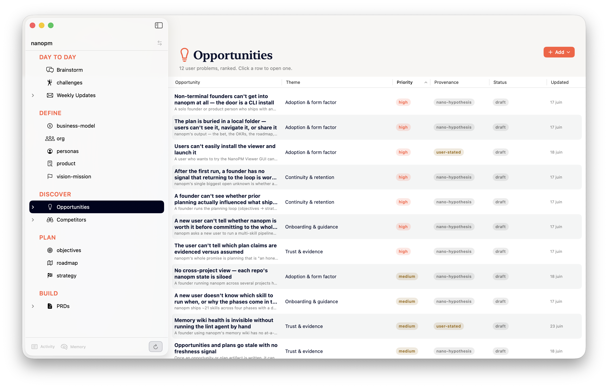

# nanopm

[](https://opensource.org/licenses/MIT)
[](CHANGELOG.md)

A PM skill pack for AI coding agents. Runs the PM workflow end-to-end — company + product context, the three external signals, the planning cycle (challenge, strategy, roadmap, PRD), and the day-to-day ops (an adversarial challenge, a jam with Nano, the standup, the weekly update) — inside the agent you already use. Keeps typed state across sessions. Won't write a PRD until you name what would prove your bet wrong.

Works with Claude Code, Mistral Vibe, and OpenAI Codex. One install command picks up whichever you have. An optional [macOS viewer](#the-viewer-macos-optional) browses the artifacts and re-runs skills on the Claude Code backend, for the moments you'd rather not be in a terminal.

Built on the SKILL.md standard from [gstack](https://github.com/garrytan/gstack). nanopm is the PM layer.

---

## Why this exists

Building the wrong thing fast is the failure mode AI coding agents make easy. They'll ship whatever you describe — they don't ask if it's the right thing.

The PM work that catches that (challenge, strategy, falsification, roadmap, retro) usually lives in tools that don't know your code, lose context between sessions, and don't talk to each other. ChatGPT for the strategy. Notion for the PRD. Linear for the tickets. Nothing compounds.

nanopm runs the whole cycle where you already work, with two structural properties:

1. **Every artifact lands in typed, schema-validated state.** Each skill writes to `~/.nanopm/projects/{slug}/{type}.jsonl`. The next skill reads from there. No grep on markdown, no silent corruption, no `tail -1 | cut -d'|'` parsing.
2. **Adversarial gates on the claims that matter.** Every strategy needs a falsifiable bet. Every NOW roadmap item needs a measurable outcome with a timeframe. Every PRD needs a paragraph stating what would prove it wrong. Each gate is a subagent against a rubric plus a state validator. A skill cannot complete unless a well-formed record actually lands.

One command runs the full pipeline: `/pm-run`. Or invoke any skill standalone.

---

## Example

```
You:     /pm-challenge-me

nanopm:  Q1: What are you building? (one sentence)
You:     An AI agent harness for financial advisors — automates
         client reporting, portfolio commentary, and compliance checks.

nanopm:  Q2: Who is it actually for?
You:     Independent RIAs managing $50M–$500M books, no ops team.

...11 questions later...

nanopm:  challenges.md written.

         Biggest gap: you're solving the reporting problem, but the
         job your users are actually hired to do is winning and
         keeping clients. Faster reports don't help if advisors
         can't explain the AI's output to a nervous client.
         Question you're avoiding: would a compliance officer
         sign off on AI-generated commentary going out unsupervised?

         Recommended next: /pm-discovery
```

---

## Who it's for

- **Solo founder running PM yourself.** Audit your own product before you keep building.
- **Engineer without a PM partner.** Strategy, roadmap and PRDs in your editor, not in a separate tab.
- **Small team without a dedicated PM seat.** A repeatable cycle that doesn't depend on a hire.

If you already have a polished product process and a PM you trust, you don't need this.

---

## Install

```bash
# Auto-detect installed agents (Claude Code, Mistral Vibe, OpenAI Codex)
curl -fsSL https://raw.githubusercontent.com/nmrtn/nanopm/main/setup | bash

# Target a specific host
curl -fsSL https://raw.githubusercontent.com/nmrtn/nanopm/main/setup | bash -s -- --host=claude
curl -fsSL https://raw.githubusercontent.com/nmrtn/nanopm/main/setup | bash -s -- --host=vibe
curl -fsSL https://raw.githubusercontent.com/nmrtn/nanopm/main/setup | bash -s -- --host=codex

# Install to all hosts at once
curl -fsSL https://raw.githubusercontent.com/nmrtn/nanopm/main/setup | bash -s -- --host=all
```

| Host | Skills install to | Invocation |
|------|-------------------|------------|
| Claude Code | `~/.claude/skills/` | `/pm-*` commands |
| Mistral Vibe | `~/.vibe/skills/` | `/pm-*` commands |
| OpenAI Codex | `~/.codex/skills/` | `/pm-*` commands |

**Requirements:** One of: Claude Code, Mistral Vibe, or OpenAI Codex. `python3` (standard on macOS/Linux).

### Claude Code plugin (optional, Claude Code only)

Claude Code users can install nanopm as a native [plugin](https://code.claude.com/docs/en/plugins.md) instead of the `curl | bash` script:

```
/plugin marketplace add nmrtn/nanopm
/plugin install nanopm
```

Commands are namespaced (`/nanopm:pm-run`) and updates flow through Claude Code's own `/plugin` manager. Mistral Vibe and OpenAI Codex don't read the plugin manifest — use the `curl | bash` installer above for those.

---

## All skills

**Planning pipeline:**
```
/pm-run              → full pipeline in one command
/pm-vision-mission   → define mission, vision, values, and company stage
/pm-business-model   → define business model, pricing, packaging, and GTM motion
/pm-org              → map the org, key roles, and decision-makers
/pm-product          → deep product map — reads code + the public site, or interviews you when greenfield
/pm-personas         → define who you're building for — JTBD personas + an explicit anti-persona
/pm-discovery        → figure out WHAT to build before planning HOW (pre-product / greenfield); includes user-interview prep
/pm-objectives       → OKRs with anti-goals and measurable key results
/pm-user-feedback    → aggregate feedback from Dovetail, Productboard, etc; cluster themes, surface top signal
/pm-competitors-intel → discover competitors, monitor + diff their pages, run SWOT + positioning analysis
/pm-opportunities    → ranked DB of user problems (Teresa Torres) — add or generate, deduped, provenance-tagged
/pm-solutions        → brainstorm ≥3 compared solutions for one opportunity — a three-lens panel (Eng / Design / Business)
/pm-strategy         → strategy + mandatory adversarial challenge (assumption, test, cost)
/pm-roadmap          → outcome-driven roadmap (Shape Up / Scrum / NOW-NEXT-LATER)
/pm-prd              → full PRD or Shape Up pitch, adapts to your methodology
/pm-breakdown        → break PRD into tasks, hand off to Linear / GitHub / OpenSpec / gstack / Human
/pm-retro            → compare roadmap vs commits, surface what drifted
```

**Daily ops:**
```
/pm-challenge-me     → three adversarial challenges: strategy, users, focus — starting with the question you're avoiding
/pm-brainstorm       → jam with Nano, your expert CPO — informal, context-loaded, resumable
/pm-standup          → morning briefing — what shipped, today's meetings, top 1-3 priorities
/pm-add-feedback     → add feedback from any source → archive raw → ground opportunities in verbatims
/pm-weekly-update    → draft stakeholder update email (CEO, investor, or team), adapted to audience
/pm-data             → answer a product question using PostHog or Amplitude — trends, funnels, retention
```

The pipeline compounds. Every skill also works standalone.

---

## How it works

nanopm runs in four zones — context first, signal in, planning cycle, delivery out. Each skill writes a Markdown page to the wiki for humans and a typed JSONL record for the next skill.

| Zone | Skills | Purpose |
|---|---|---|
| **1. Define** | vision-mission · business-model · org · product · personas | Company + product context: the business, the org, who it's for, the product map |
| **2. Discover** | user-feedback · interview · data · competitors-intel · opportunities | The three external signals (research, analytics, market), distilled into a ranked DB of user problems |
| **3. Plan** | objectives → strategy → roadmap → solutions → prd → breakdown | Runs in sequence; each reads typed state from the prior |
| **4. Handoffs** | Linear · GitHub · OpenSpec · gstack · Symphony · Human | `/pm-breakdown` writes to whichever target fits — see [Handoffs](#handoffs) |

Discover and Plan share one spine — the Opportunity Solution Tree (Teresa Torres): objectives are the **outcomes**, the ranked DB holds the **opportunities**, and `/pm-solutions` fills the node that was missing — it takes one opportunity and brainstorms a *compared set* of candidate **solutions** (a three-lens Eng / Design / Business panel, each with an appetite, a riskiest assumption, and its cheapest test), so you weigh competing options instead of jumping from the first idea straight to a PRD. You shortlist and choose; the agent never auto-chooses, and `/pm-prd <chosen-solution>` then seeds the spec from the solution and its parent opportunity.

Two one-page briefs are regenerated whenever their phase changes and reloaded into every run — `company.md` (who you are) and `current-work.md` (the bet, the OKRs, what's NOW) — so every skill works from the same baseline instead of drifting. Daily Ops skills (`/pm-challenge-me`, `/pm-brainstorm`, `/pm-standup`, `/pm-weekly-update`, `/pm-retro`) run on any day, outside the pipeline.

Run `/pm-run` for the whole sequence, or invoke any skill standalone.

---

## How a skill works — three primitives over the wiki

Every skill, whatever its job, is the **same recipe over the memory wiki** — it never starts from a blank prompt and it keeps no bespoke read logic. It **queries** the wiki for what it needs, **reasons** over what it got, and **ingests** the result back; a **lint** pass keeps the whole thing honest after the fact. That uniformity is the point: add a skill and it inherits the shared memory, the citations, and the health checks for free.

- **query** *(read)* — a subagent reads the wiki catalog, drills into only the pages that matter, and returns a **cited** synthesis — never the raw docs dumped into context, and a missing answer is named rather than invented. It's how `/pm-prd` pulls the right persona and the quantified problem size, and how `/pm-solutions` grounds its Eng/Design/Business panel on the real personas, objectives, and product surface.
- **reasoning** — the skill's actual work, and the only part that differs skill to skill: the adversarial bet gate in `/pm-strategy`, the three-lens panel in `/pm-solutions`, the dedup-and-rank in `/pm-opportunities`, the methodology-aware spec in `/pm-prd`.
- **ingest** *(write)* — the result is written back as a wiki page (and, where it matters, a typed JSONL decision), single-writer-per-file and locked, after which the index is regenerated so the next skill can find it.
- **lint** *(honesty pass)* — there's no pre-write approval gate; a structural + judgment lint runs *after the fact*, surfacing contradictions, orphans, broken links, stale pages, and drift. **Write freely, lint surfaces, you curate.**

So a single run reads like one sentence: *query the wiki → reason → ingest back → lint keeps it honest.* The wiki those primitives operate on — a small, always-current body of pages rather than an ever-growing chat log — is described under [Memory](#memory).

---

## The viewer (macOS, optional)

Prefer not to live in a terminal? The optional **NanoPM Viewer** is a native macOS app that browses everything in `.nanopm/` — artifacts grouped by phase (Define / Discover / Plan / Build), rendered as Markdown, with the compounding entity pages (opportunities, solutions, competitors, PRDs) as first-class views — the Solutions table filters and navigates opportunity↔solution in both directions.



It's also a launcher: re-run any skill on the Claude Code backend without typing a command, follow live runs in an Activity Monitor, and jam with Nano in a graphical Brainstorm chat. Browsing is strictly read-only; running a skill spawns the `claude` CLI under an explicit tool allow-list.

It's an early, deliberately throwaway prototype — see [`viewer/README.md`](viewer/README.md) to build and run it.

---

## Memory

nanopm remembers across sessions, so each run builds on the last instead of starting cold. Memory is a **maintained wiki**, not a chat log — a small set of always-current pages the agent reads at the start of every run, with deterministic CLIs to keep it tidy. (The pattern is Karpathy's [LLM wiki](https://gist.github.com/karpathy/442a6bf555914893e9891c11519de94f).)

- **Two briefs, always loaded.** `wiki/overview/company.md` (who the company is) and `wiki/overview/current-work.md` (the bet, the OKRs, what's NOW) are regenerated when their phase changes and reloaded into every run — so all work shares one baseline instead of drifting.
- **Entity pages that compound.** Personas, competitors, opportunities, solutions, objectives, features, and people each get a page that many sources refine over time, with citations — new evidence supersedes old claims (keeping the history) instead of stacking duplicate notes. Solutions link back to their parent opportunity (one edge of the Opportunity Solution Tree), navigable from either end.
- **Just files + git.** No database, no server. A project's `.nanopm/` is two layers: `raw/` (immutable sources — connector pulls, the typed event log, page snapshots) and `wiki/` (all generated content — the briefs, skill outputs, compounding entity pages). Plain Markdown you can read, diff, and edit.
- **Health tooling.** A lint pass flags stale pages, orphans, broken links, and contradictions (and warns when a `challenges`/`strategy` page drifts past 20 commits); an ingest pass dedupes by citation. Writes apply directly — there's no pre-write approval queue; quality is kept honest *after the fact* by the judgment lint (write freely, lint surfaces, you curate).

Alongside the wiki, PM **decisions** are recorded as append-only, schema-validated JSONL under `~/.nanopm/projects/{slug}/` — typed `bet`, `target`, `question`, `scope-out`… records, each carrying confidence (1–10) and provenance. Every write goes through a validator that enforces the schema and fails loud on bad input — no silent appends. Re-run `/pm-challenge-me` six months later and it reads the prior decisions before asking anything new.

> **Status:** the always-loaded briefs and the maintenance loop are wired; the signal skills dispatch the ingest bookkeeper to write entity pages directly after each run, and the lint health pass (structural + judgment) runs daily. Still maturing — ingest quality compounds as you feed it real interviews, feedback, and data, and not every skill writes entity pages yet.

---

## How it compares

| | nanopm | DIY prompts in your agent | Notion / Linear | ChatGPT |
|---|---|---|---|---|
| Lives in your editor | ✅ | ✅ | ❌ | ❌ |
| Typed memory across sessions | ✅ schema-validated JSONL | ❌ | ⚠️ manual writes | ❌ |
| Full PM pipeline (challenge → PRD) | ✅ | ⚠️ if you reprompt every time | ❌ | ❌ |
| Reads your codebase | ✅ | ✅ | ❌ | ❌ |
| Adversarial gates on bets & outcomes | ✅ subagent + state validator | ❌ | ❌ | ❌ |
| Peer handoff targets | ✅ Linear / GitHub / OpenSpec / gstack / human | ⚠️ ad-hoc | ⚠️ Linear only | ❌ |
| Multi-host (Claude / Vibe / Codex) | ✅ | n/a | n/a | n/a |
| Adapts to Shape Up / Scrum / Kanban | ✅ | ⚠️ if you prompt it | ✅ | ❌ |
| Zero-config — works without integrations | ✅ tier 4 manual | ✅ | ❌ | ✅ |

The point isn't to replace your tracker. The point is to make the decisions *before* the tracker — and make sure those decisions are typed, falsifiable, and still here next session.

---

## How it gets data

nanopm tries each tier in order, uses the highest available:

| Tier | How | Setup |
|------|-----|-------|
| 1 — MCP | Direct tool calls | Add `mcp__linear__*` etc. to your agent's config |
| 2 — API | REST/GraphQL | Set `LINEAR_API_KEY`, `NOTION_API_KEY`, `GITHUB_TOKEN`, etc. |
| 3 — Browser | Headless scrape | Install browse binary, sign in once in your browser |
| 4 — Manual | You fill it in | Always works, zero setup |

No integrations required. Tier 4 always works.

**Connectors:**

| Connector | Primary use | Tier 1 (MCP) | Tier 2 (API key) |
|-----------|------------|-------------|-----------------|
| Linear | Sprint, issues, roadmap | ✅ | `LINEAR_API_KEY` |
| GitHub Issues | PRs, releases, issues | ✅ | `GITHUB_TOKEN` |
| Notion | Pages, databases | ✅ | `NOTION_API_KEY` |
| Dovetail | Insights, themes | — | `DOVETAIL_API_KEY` |
| Productboard | Features, user notes | — | `PRODUCTBOARD_API_KEY` |
| PostHog | Trends, funnels, retention | ✅ | `POSTHOG_API_KEY` |
| Amplitude | Trends, funnels, retention | — | `AMPLITUDE_API_KEY` |
| Mixpanel | Event trends, funnels | — | `MIXPANEL_SERVICE_ACCOUNT` |
| Google Calendar | Today's meetings | ✅ | — |
| Granola | Meeting transcripts | ✅ | — |
| Intercom | Support tickets, themes | — | `INTERCOM_API_TOKEN` |
| HubSpot | Pipeline, ICP signal | — | `HUBSPOT_API_KEY` |
| Jira | Sprint, blockers | (preview) | `JIRA_API_TOKEN` |
| Google Drive | PRDs, research docs | ✅ | — |
| Slack | Channel decisions | ✅ | `SLACK_API_TOKEN` |

See [`connectors/README.md`](connectors/README.md) for full setup details per connector.

---

## Methodology support

nanopm detects your methodology at challenge time (CONTEXT.md intake) and adapts its artifacts:

- **Shape Up** → roadmap uses bets + appetite + cool-down; PRDs become pitches
- **Scrum/Agile** → roadmap uses sprint framing, epics, story points
- **Kanban / hybrid / none** → NOW/NEXT/LATER roadmap, standard PRDs

---

## Handoffs

nanopm runs the PM half; delivery lives elsewhere. `/pm-breakdown` writes the breakdown to one of six peer targets — no preferred default, you pick the one that fits how the project actually ships. Every handoff is logged to `~/.nanopm/projects/{slug}/handoff.jsonl` — typed, schema-validated, queryable later.

| Target | What gets written | Pick up with |
|---|---|---|
| **Linear** | Issues in a Linear team, each with acceptance criteria + a link back to the PRD | Linear (MCP or `LINEAR_API_KEY`) |
| **GitHub Issues** | Repo issues, body links the PRD and embeds acceptance | GitHub (MCP or `GITHUB_TOKEN`) |
| **OpenSpec** | `openspec/changes/{feature}/` — `proposal.md`, `design.md`, `tasks.md`, spec as SHALL statements | `/opsx:apply` |
| **gstack** | `~/.gstack/projects/{slug}/ceo-plans/{date}-{feature}.md` with `status: ACTIVE` | `/plan-ceo-review` or `/autoplan` |
| **Symphony** | `WORKFLOW.md` at repo root + Linear issues (embeds PRD path, typed bet, falsification, out-of-scope) | [OpenAI Symphony](https://github.com/openai/symphony) (Linear-only) |
| **Human** | Self-contained `.nanopm/wiki/docs/handoffs/{feature}.md` — PRD body + copy-paste ticket blocks | paste into any tracker |

If your repo already uses OpenSpec, `/pm-product` reads `openspec/specs/` automatically — specs describe intent more accurately than READMEs.

---

## Uninstall

```bash
bash uninstall          # removes skills, keeps ~/.nanopm/ memory
bash uninstall --purge  # removes everything including memory and config
```

---

## Contributing

Add a connector: one markdown file in `connectors/` (see [`connectors/README.md`](connectors/README.md)).
Add a skill: copy any `pm-*/SKILL.md` and follow the preamble pattern in `lib/nanopm.sh`.

```bash
bash test/run-all.sh             # full local suite (no LLM, no network)
bash test/run-all.sh --with-llm  # also run the adversarial e2e (needs the claude CLI)
```

`run-all.sh` wraps the individual suites (skill syntax, state-layer validators, multi-host resolution, ETHOS gates, update-check, the wiki-canonical and e2e checks) — run any of them directly from `test/` while developing.

---

## Authors

Created and maintained by **Nicolas Martin** ([@nmrtn](https://github.com/nmrtn)) and **Guillaume Simon**, co-authors.

---

*Built on the SKILL.md standard from [gstack](https://github.com/garrytan/gstack).*
